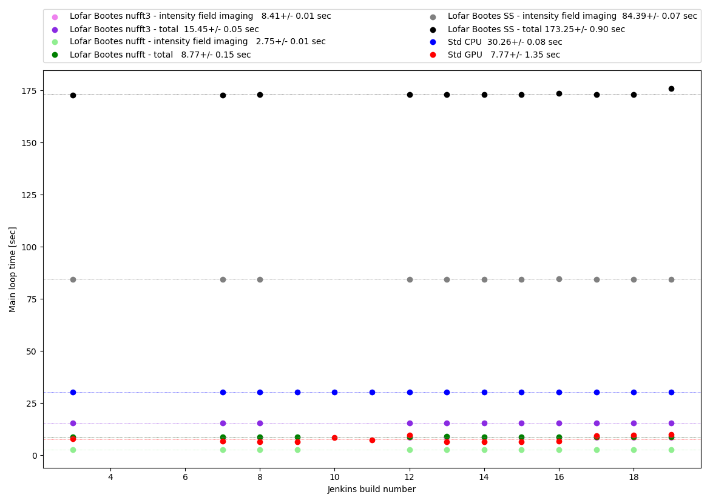
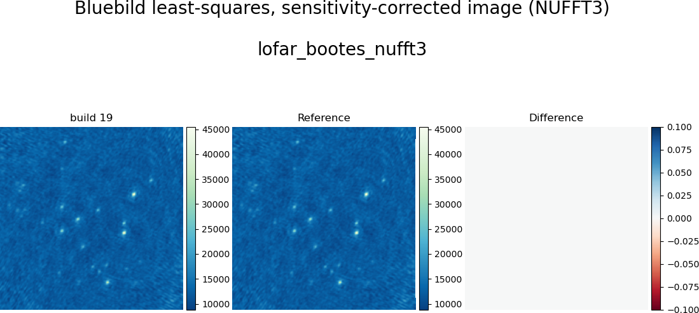

# SKA Bluebild monitoring

## Setup
 - Jenkins is configured to run through the "compte de service" `scitas-ska` on the front node of the GPU cluster of EPFL named ``izar`` (managed by SCITAS). Account for which we don't have the password.
 -  Jenkins is set up to monitor branches named ``ci-*`` (and branch ``eo_jenkins`` for now).  Every minute, Jenkins checks whether something was pushed into the Github repository and triggers a build if this is the case.
 - All timing/profiling scripts are submitted on `izar` using `Slurm` job scheduler via `srun` or `sbatch --wait`, what allows for immediate failure detection (each job script is configured with `set -e`).
 - The console is available here: https://scitasadm.epfl.ch/ci/job/orliac-ska/job/ci-master/ (for branch ci-master)
 

## Jenkinsfile
- Everything is orchestered through the different "stages" defined in the  [Jenkinsfile](https://github.com/etolley/pypeline/blob/ci-master/Jenkinsfile).
- Options are set via environment variables. For example, to activate or not the different profiling tools:
```
// Set to "1" to run corresponding profiling
PROFILE_CPROFILE = "1"
PROFILE_NSIGHT   = "1"
PROFILE_VTUNE    = "1"
PROFILE_ADVISOR  = "0" // can be very time-consuming
```

### Stage "Management"
 As already mentionned we don't have the password for the ``scitas-ska`` account, situation with pros and cons. On the negative side, some operations would be much faster and much less painful just logging in as ``scitas-ska`` and executing commands in a shell. On the positive side, forcing us to carry out all operations through Jenkins has the advantage to log any operation carried out (as we need to commit and push modifications on the Bash file to be run). The "Management" stage should be used for this.

### Stage "Build"
 - Should be deactivated most of the time. It is mainly used to install Conda and generate new Conda environments if required or `pip install` new packages. See [jenkins/install.sh](https://github.com/etolley/pypeline/blob/ci-master/jenkins/install.sh).
 - The Conda environment used for monitoring the builds should be updated only when strictly required.
 - The Conda actually used is called pype-111 and was created based on https://github.com/etolley/pypeline/blob/ci-master/conda_environments/pype-111.yml. 

### Stages "Standard CPU" and "Standard GPU"
For these two stages running the stantard synthesizer on CPU and GPU respectively, a configurable submission file is used: [jenkins/slurm_generic_synthesizer.sh](https://github.com/etolley/pypeline/blob/ci-master/jenkins/slurm_generic_synthesizer.sh). The two options to retain act on the number of time steps to process and the type of architecture to run on (CPU or GPU). The others can be considered obsolete (the choice of the algorithm between standard and periodic, and activation of a benchmark based on Python multi-processing package).

The first step in the script is the timing one. The pipeline to monitor run there a first time without any profiling to measure time to solution (TTS) without any overhead.

```
echo "### Timing/memory usage"
time python $PY_SCRIPT ${TEST_ARCH} ${TEST_ALGO} ${TEST_BENCH} ${TEST_TRANGE} $ARG_TEST_DIR
ls -rtl $TEST_DIR
echo; echo
```

Note that for monitoring we use timestamps defined in the pipeline over regions of interest.

The Python pipeline that is monitored is defined in `PY_SCRIPT`:
```
# Script to be run
PY_SCRIPT="./benchmarking/generic_synthesizer.py"
```
which contains, e.g., a section that looks like:
```
### Serial
tic = time.perf_counter()
#
# DO SOME WORK
#
toc = time.perf_counter()
print(f"Serial {toc-tic:12.6f} sec")
```
Then the monitoring script will be looking for the first occurence of the label (here "Serial", kept not to break history so far, but newer ones are more uniquely defined) to extract the run time spent on the specific section of the code.

If running on GPU, NSight profiling is conducted, if requested:
```
if [[ $ARCH == 'GPU' && $RUN_NSIGHT == "1" ]]; then
    echo "### Nsight"
    nsys --version
    nsys profile -t cuda,nvtx,osrt,cublas --sample=cpu --cudabacktrace=true --force-overwrite=true --stats=true --output=$TEST_DIR/nsys_out $PYTHON $PY_SCRIPT ${TEST_ARCH} ${TEST_ALGO}
    echo; echo
fi
```

Then Python cProfile is run:
```
if [ $RUN_CPROFILE == "1" ]; then
    echo "### cProfile"
    python -m cProfile -o $TEST_DIR/cProfile.out $PY_SCRIPT ${TEST_ARCH} ${TEST_ALGO}
    echo; echo
fi
```

Followed by the 3 available profiling analysis types available with Intel Vtune for Python:
```
if [ $RUN_VTUNE == "1" ]; then
    echo "### Intel VTune Amplifier"
    source /work/scitas-ge/richart/test_stacks/syrah/v1/opt/spack/linux-rhel7-skylake_avx512/gcc-8.4.0/intel-oneapi-vtune-2021.6.0-34ym22fgautykbgmg5hhgkiwrvbwfvko/setvars.sh || echo "ignoring warning"
    which vtune
    echo listing of $TEST_DIR
    ls -rtl $TEST_DIR
    vtune -collect hotspots           -run-pass-thru=--no-altstack -strategy ldconfig:notrace:notrace -source-search-dir=. -search-dir=. -result-dir=$TEST_DIR/vtune_hs  -- $PYTHON $PY_SCRIPT ${TEST_ARCH} ${TEST_ALGO}
    vtune -collect hpc-performance    -run-pass-thru=--no-altstack -strategy ldconfig:notrace:notrace -source-search-dir=. -search-dir=. -result-dir=$TEST_DIR/vtune_hpc -- $PYTHON $PY_SCRIPT ${TEST_ARCH} ${TEST_ALGO}
    vtune -collect memory-consumption -run-pass-thru=--no-altstack -strategy ldconfig:notrace:notrace -source-search-dir=. -search-dir=. -result-dir=$TEST_DIR/vtune_mem -- $PYTHON $PY_SCRIPT ${TEST_ARCH} ${TEST_ALGO}
    echo; echo
fi
```

## Stages "lofar_bootes_nufft_small_fov", "lofar_bootes_ss" and "lofar_bootes_nufft3"
They follow the same scheme as presented in the previous section. However, there are 4 sections monitored:

1. `print(f"#@#IFPE {ifpe_e-ifpe_s:.3f} sec")` for the Intensity Field Parameter Estimation block
2. `print(f"#@#IFIM {ifim_e-ifim_s:.3f} sec")` for the Intensity Field IMaging block
3. `print(f"#@#SFPE {sfpe_e-sfpe_s:.3f} sec")` for the Sensitivity Field Parameter Estimation block
4. `print(f"#@#SFIM {sfim_e-sfim_s:.3f} sec")` for the Sensitivity Field IMaging block

Again, the first occurence of these 4 keywords (#@#IFPE, #@#IFIM, #@#SFPE and #@#SFIM) are used by the monitoring script to extract the corresponding run times from the timing run (i.e. with no profiling).


## Stage "Seff"
This stage is used to run the resource usage efficiency reported by Slurm `seff` utility. Because to recover the ID of the submitted job requires sbatch --parsable to then submit it to `seff`, a special switch was setup via setting the environment variable `TEST_SEFF` to 1, that triggers an early exit just after the timing run (so that only the true resource usage is reported from the timing run):

```
echo "### Timing/memory usage"
time python $PY_SCRIPT [OPTIONS]
ls -rtl $TEST_DIR
echo; echo

# Running with TEST_SEFF=1 causes an early exit
if [ $EARLY_EXIT == "1" ]; then
    echo "TEST_SEFF set to 1 -> exit 0";
    exit 0
fi
```

## Stage "Monitoring"
### Plotting
Two scripts are being run in this stage: `jenkins/tts.py` and `jenkins/imap.py`.

###`jenkins/tts.py`
 - The script parses the Slurm logs to extract, analyses and plots the different timings as configured in the script.
 - On the plot are given the statistics over all builds.
 - The script generates a statistics file `stats_rt.txt` that also contains statistics based on a sliding windows over the N = 10 last builds.
 
{:height="60%" width="60%"}

### `jenkins/imap.py`
 - This script compares the generated images in the build to a reference solution.
 - It generates a statistics file `stats_img.txt` containing RMS error between the reference images and the solutions.

{:height="60%" width="60%"}


### Monitoring
Based on the generated statistics files, WARNINGs are being issued in the `monitoring` Slack channel whenever:
1. There is not enough builds available for a given solution
2. The last reported time is greater the sliding average + 3 sigmas (computed over the last 10 builds available).
3. The RMS error in the last build images over reference images are greater than a predefined threshold.

```
WARNING(s) detected in run times statistics!
...
s_w LBSSt 7 19 10 172.996   0.179 lofar_bootes_ss      "Lofar Bootes SS - total"  WARNING  last build (19) significantly slower: 176.04 > 173.53 (172.996 + 3 x 0.179)
...
```
or

```
WARNING(s) detected in image statistics!
LBN RMSE = 596.948756 /work/backup/ska/ci-jenkins/izar-ska/eo_jenkins/2021-11-29T09-14-39Z_192/lofar_bootes_nufft_small_fov/I_lsq_eq_data.npy - /work/backup/ska/ci-jenkins/references/lofar_bootes_nufft_small_fov/I_lsq_eq_data.npy on /work/backup/ska/ci-jenkins/references/lofar_bootes_nufft_small_fov/I_lsq_eq_grid.npy WARNING RMSE > 0.001
```

## Reference solutions
The reference solutions are (for now) established as symbolink links to a previous solution:

```
$ ll /work/backup/ska/ci-jenkins/references/
total 5
lrwxrwxrwx 1 scitas-ska hpc-ska  91 Nov 29 20:22 lofar_bootes_nufft3 -> /work/backup/ska/ci-jenkins/izar-ska/eo_jenkins/2021-11-29T17-36-15Z_3//lofar_bootes_nufft3
lrwxrwxrwx 1 scitas-ska hpc-ska 100 Nov 29 20:04 lofar_bootes_nufft_small_fov -> /work/backup/ska/ci-jenkins/izar-ska/eo_jenkins/2021-11-29T17-36-15Z_3//lofar_bootes_nufft_small_fov
lrwxrwxrwx 1 scitas-ska hpc-ska  87 Nov 29 20:22 lofar_bootes_ss -> /work/backup/ska/ci-jenkins/izar-ska/eo_jenkins/2021-11-29T17-36-15Z_3//lofar_bootes_ss
lrwxrwxrwx 1 scitas-ska hpc-ska  89 Nov 29 20:22 test_standard_cpu -> /work/backup/ska/ci-jenkins/izar-ska/eo_jenkins/2021-11-29T17-36-15Z_3//test_standard_cpu
lrwxrwxrwx 1 scitas-ska hpc-ska  89 Nov 29 20:22 test_standard_gpu -> /work/backup/ska/ci-jenkins/izar-ska/eo_jenkins/2021-11-29T17-36-15Z_3//test_standard_gpu
```

## Accessing the results
All the logs and outputs are written in a folder dedicated to the monitored branch:
```
/work/backup/ska/ci-jenkins/izar-ska/ci-branch_name/
```
It contains folders for each of the build, e.g.:
```
$ ll /work/backup/ska/ci-jenkins/izar-ska/ci-master/
drwxr-sr-x 9 scitas-ska hpc-ska 4096 Dec  2 15:10 2021-12-02T13-16-50Z_1
```
named after the launch date and time of the build + "_" + the build number (1 in this case).

Inside the structure reflects the stages of the Jenkinsfile:
```
$ ll /work/backup/ska/ci-jenkins/izar-ska/ci-master/2021-12-02T13-16-50Z_1/
total 7
drwxr-sr-x 5 scitas-ska hpc-ska 4096 Dec  2 15:01 lofar_bootes_nufft3
drwxr-sr-x 5 scitas-ska hpc-ska 4096 Dec  2 14:37 lofar_bootes_nufft_small_fov
drwxr-sr-x 5 scitas-ska hpc-ska 4096 Dec  2 14:54 lofar_bootes_ss
drwxr-sr-x 2 scitas-ska hpc-ska 4096 Dec  2 15:11 monitoring
drwxr-sr-x 7 scitas-ska hpc-ska 4096 Dec  2 15:10 seff
drwxr-sr-x 5 scitas-ska hpc-ska 4096 Dec  2 14:20 test_standard_cpu
drwxr-sr-x 5 scitas-ska hpc-ska 4096 Dec  2 14:30 test_standard_gpu
```

In each of the solution directory can be found the differents outputs (from the script and the profilers):
```
$ ll /work/backup/ska/ci-jenkins/izar-ska/ci-master/2021-12-02T13-16-50Z_1/lofar_bootes_nufft3/
total 11619
-rw-r--r-- 1 scitas-ska hpc-ska 1918242 Dec  2 14:59 cProfile.out
-rw-r--r-- 1 scitas-ska hpc-ska 3145856 Dec  2 14:59 I_lsq_eq_data.npy
-rw-r--r-- 1 scitas-ska hpc-ska 6291584 Dec  2 14:59 I_lsq_eq_grid.npy
-rw-r--r-- 1 scitas-ska hpc-ska  244665 Dec  2 15:03 slurm-799161.out
-rw-r--r-- 1 scitas-ska hpc-ska  183174 Dec  2 14:59 test_nufft3.png
drwxr-sr-x 7 scitas-ska hpc-ska    4096 Dec  2 15:01 vtune_hpc
drwxr-sr-x 7 scitas-ska hpc-ska    4096 Dec  2 15:00 vtune_hs
drwxr-sr-x 7 scitas-ska hpc-ska    4096 Dec  2 15:03 vtune_mem
```

## Using the results
Because of the permissions set the on `/work/backup/ska` it is sometimes needed to copy the results outside to a location where the user has write permissions. E.g. it is the case for open the Vtune outputs.

Note that a non-standard version of the Intel tools are used and can be loaded with:
```
source /work/scitas-ge/richart/test_stacks/syrah/v1/opt/spack/linux-rhel7-skylake_avx512/gcc-8.4.0/intel-oneapi-vtune-2021.6.0-34ym22fgautykbgmg5hhgkiwrvbwfvko/setvars.sh
```
and
```
source /work/scitas-ge/richart/test_stacks/syrah/v1/opt/spack/linux-rhel7-skylake_avx512/gcc-8.4.0/intel-oneapi-advisor-2021.4.0-any7cfov5s4ujprr7plf7ks7xzoyqljz/setvars.sh
```
for Vtune and Advisor respectively. This version will be made generally available with the next software stack release on the clusters.

Also, for the GPU NSight profile it highly recommended to install NSight on a local computer and transfer the results for exploration, this incredibly much faster than going from the X server.

## TO DO
 - Rather than monitoring full pipelines it could be more efficient to monitor smaller unit blocks.

## TO FIX
 - Vtune outputs link to actual source files which is a problem when opening older profiling outputs (as it won't link against the source code that was actually profiled, hence line numbers will be wrong for modified sources).

